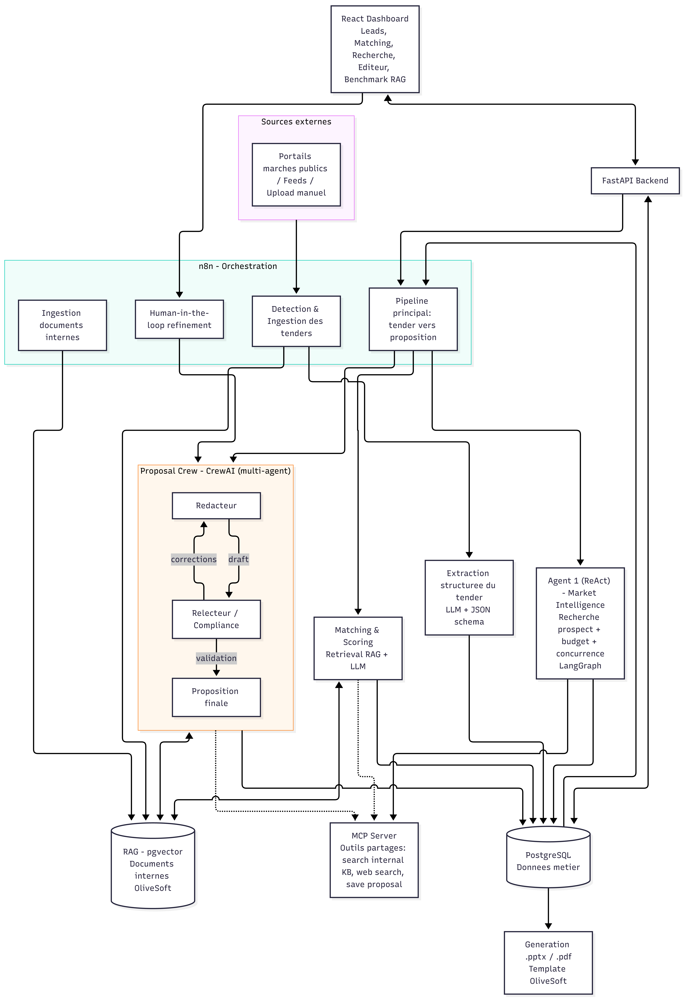
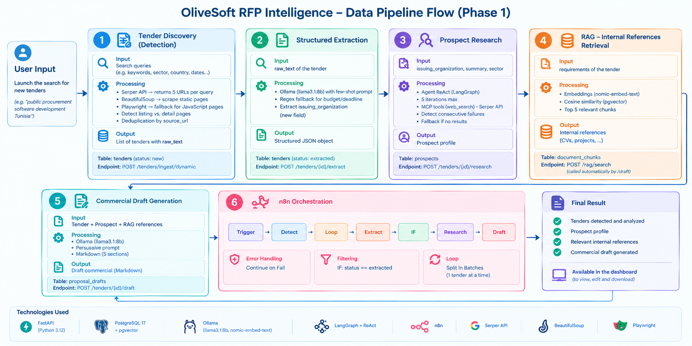

# Data Pipeline Flow: OliveSoft RFP Intelligence (Phase 1)

## Overview

The OliveSoft RFP Intelligence system is an automated pipeline that:
1. Detects tenders published on the web
2. Extracts structured information
3. Researches the prospect
4. Retrieves relevant internal references (RAG)
5. Generates a personalized commercial draft

> **Important note:** This document describes the **Phase 1 data pipeline only**. Later phases will introduce deeper prospect filtering, tender scoring, and more advanced matching mechanisms (see the "Future Evolution" section at the end).

---

## Data Flow Step by Step

### Prerequisite: Vectorization and Storage in pgvector

**Before the workflow is launched**, the internal knowledge base (CVs, past projects, client portfolios, tools, technical stacks) must be **vectorized and stored in pgvector**. This step is performed **once** (or when new documents are added) and is **not part of the workflow execution**.

- **Input**: PDF documents placed in `backend/data/internal_docs/`
- **Processing**:
  - Text extraction via `pdfplumber`
  - Chunking (300 words with 50-word overlap)
  - Embeddings via Ollama (`nomic-embed-text`)
  - Storage in PostgreSQL with `pgvector` extension
- **Output**: Vectorized chunks stored in the `document_chunks` table
- **Endpoint**: `POST /rag/ingest/bootstrap` (manual, outside the workflow)

---

### Step 1: Tender Detection
- **Input**: Search queries (e.g., "appel d'offres développement logiciel Tunisie")
- **Processing**:
  - Serper API → returns 5 URLs per query
  - BeautifulSoup → scrapes static pages
  - Playwright → fallback for JavaScript-heavy pages
  - Listing vs detail page detection
  - Deduplication by `source_url`
- **Output**: List of tenders with `raw_text` stored in PostgreSQL
- **Table**: `tenders` (status `new`)
- **Endpoint**: `POST /tenders/ingest/dynamic`

### Step 2: Structured Extraction
- **Input**: Tender `raw_text`
- **Processing**:
  - Ollama (llama3.1:8b) with few-shot prompt
  - Regex fallback for budget/deadline
  - Extraction of `issuing_organization`
- **Output**: Structured JSON object
- **Table**: `tenders` (status `extracted`)
- **Endpoint**: `POST /tenders/{id}/extract`

### Step 3: Prospect Research
- **Input**: `issuing_organization`, `summary`, `sector`
- **Processing**:
  - ReAct Agent (LangGraph) with max 5 iterations
  - MCP calls: `web_search` → Serper
  - Consecutive failure detection
  - Fallback output if nothing found
- **Output**: Prospect profile
- **Table**: `prospects`
- **Endpoint**: `POST /tenders/{id}/research`

### Step 4: RAG: Internal Reference Retrieval
- **Input**: Tender `requirements`
- **Processing**:
  - Embeddings via Ollama (`nomic-embed-text`)
  - Cosine similarity search in pgvector
  - Returns top 5 most relevant chunks
- **Output**: List of internal references (CVs, projects)
- **Table**: `document_chunks`
- **Endpoint**: `POST /rag/search` (called automatically by `/draft`)

### Step 5: Draft Generation
- **Input**: Tender + Prospect + RAG references
- **Processing**:
  - Ollama (llama3.1:8b) with persuasive prompt
  - Markdown structure in 5 sections
- **Output**: Commercial draft in Markdown
- **Table**: `proposal_drafts`
- **Endpoint**: `POST /tenders/{id}/draft`

### Step 6: n8n Orchestration
- **Workflow**: 6 nodes (Trigger → Detect → Loop → Extract → IF → Research → Draft)
- **Error handling**: Continue on Fail
- **Filtering**: IF node on `status == extracted`
- **Loop**: Split In Batches (1 tender at a time)

> **Note:** For Phase 1 testing purposes, the workflow is currently limited to **5 prospects per execution**. This is a configurable parameter (`results_per_query` in `tender_detection_service.py`) and can be extended for production use.

---

## Flow Diagram

---

## Technologies Used

| Component | Technology | Role |
| :--- | :--- | :--- |
| Backend | FastAPI (Python 3.12) | REST API |
| Database | PostgreSQL 17 + pgvector | Storage + vector search |
| LLM | Ollama (llama3.1:8b) | Extraction, agent, draft |
| Embeddings | Ollama (nomic-embed-text) | RAG |
| Agent | LangGraph + ReAct | Prospect research |
| MCP | Anthropic Protocol | Agent tools |
| Orchestration | n8n | Workflow |
| Web Search | Serper API | Tender detection |
| Scraping | BeautifulSoup + Playwright | Content extraction |

---

## Future Evolution (Phase 2 and Beyond)

This document describes the **Phase 1 data pipeline only**. The following improvements are planned for future phases:

- **Deeper prospect filtering**: Filtering tenders based on strategic criteria (sector relevance, budget threshold, deadline feasibility).
- **Tender scoring**: Automatic scoring (0–100) of each tender's fit with OliveSoft's expertise.
- **Matching & Scoring**: Matching each tender requirement against internal CVs/projects with a relevance score, using an LLM-based reranker.
- **Multi-agent CrewAI**: Replacing the single-LLM draft with a CrewAI crew (Writer + Reviewer/Compliance + Final).
- **PPT/PDF generation**: Automated generation of commercial presentations matching OliveSoft's branding.
- **Scalable prospect research**: Extending the workflow beyond the current 5-prospect test limit to handle dozens of tenders per execution.
- **RAG Benchmark**: Measuring retrieval precision (Recall@k, MRR) and optimizing embeddings.